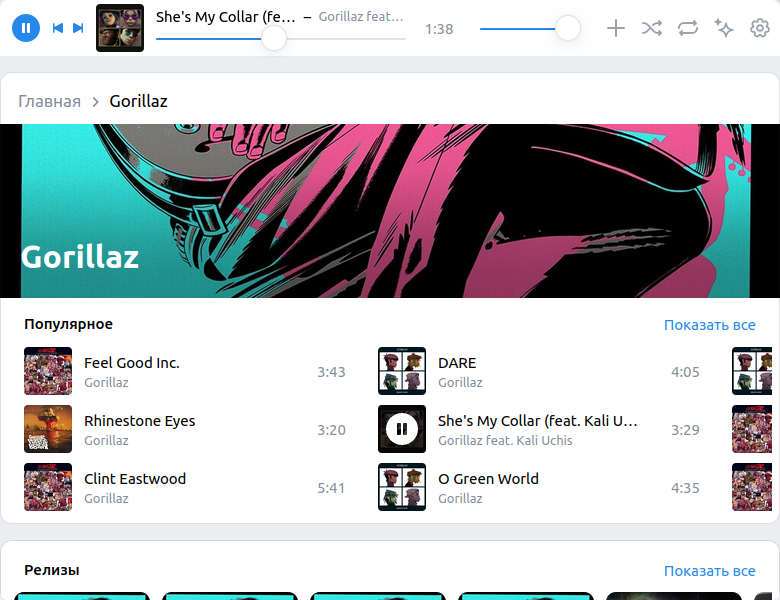

# VK Audiopad

Chrome extension for [VK Music](https://music.vk.com/)

|              dark               |               light               |
| :-----------------------------: | :-------------------------------: |
|  |  |

## Try it

[Chrome Web Store](https://chrome.google.com/webstore/detail/plclpmphdjmdgmdpfkcmdkmohgpfecip)  
[Add-ons for Firefox](https://addons.mozilla.org/ru/firefox/addon/vkaudiopad/)  
[~~Opera Addons~~](https://addons.opera.com/ru/extensions/details/vk-audiopad/)  

## Build

1. run ./build.sh

   ```bash
   docker run -it --rm --name vk-audiopad-build -v "$PWD":/usr/src/app --user $(id -u) -w /usr/src/app node:20-alpine /bin/sh build.sh
   ```

2. zip folder ./extension

   ```bash
   (cd extension; zip -r ../vk-audiopad.zip *)
   ```

## Architectural methodology

Project based on [Feature-Sliced Design](https://feature-sliced.design/)
